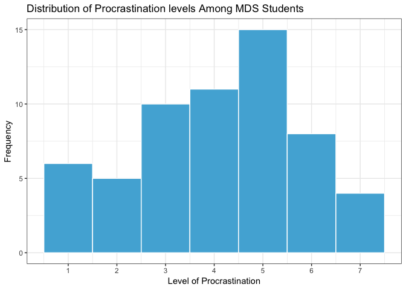
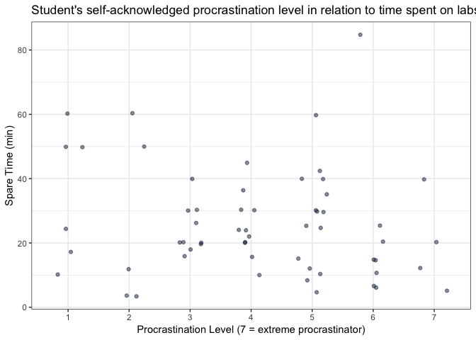
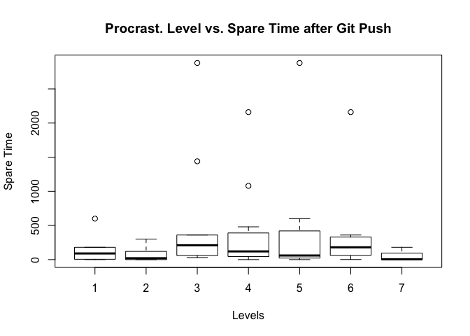
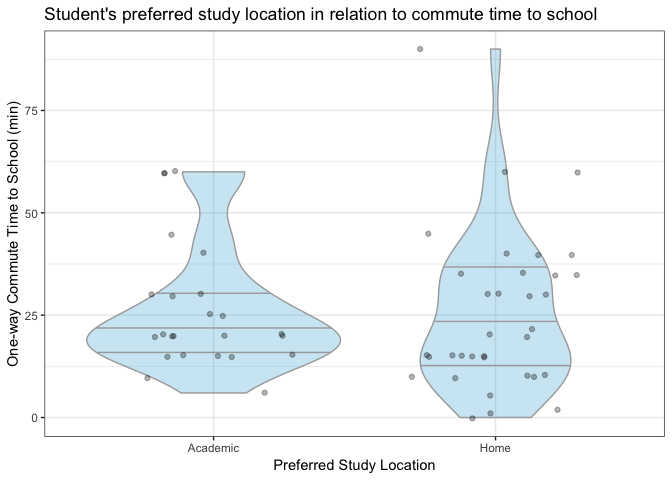

Milestone2
================
Simon Chiu, Sabrina Tse, Sylvia Lee, Hayley Boyce
2019-04-03

Introduction
------------

Survey link: <https://ubc.ca1.qualtrics.com/jfe/form/SV_agz0I9HiBEeZqBL>

The survey was conducted online anonymously during the lab session on April 3rd, 2019. We expected that most of the responders were UBC MDS students in the 2018-2019 cohort since the survey content focused on gathering MDS students' study behaviour and location preference. In total, we received 65 responses.

The Data
--------

Our survey had 59 participants from the MDS program answer questions regarding lab completion times specifically for Block 5. We found specifying the lab tiem to a particular competed block that was recent would contribute to more accurate results. To keep complete anonymity, we did not collect any data that could be considered as direct or quasi identifying.

**Language** Due to the statistical nature of the lab and an overall consensus, we agreed on programming in R.

``` r
kable(head(data))
```

| Location |  OptionalQ|  ProcrastLV|  Household\_Hr|  Commute\_Hm\_Sch\_Min|  Commute\_Stu\_Loc\_Min|  Time\_On\_Lab\_Hr|  Spare\_Time\_Min|
|:---------|----------:|-----------:|--------------:|----------------------:|-----------------------:|------------------:|-----------------:|
| Academic |        0.0|           7|            3.0|                     20|                      10|                 12|                10|
| Home     |        0.0|           6|            2.5|                     35|                       0|                 11|               120|
| Academic |        0.0|           1|            2.5|                     20|                      10|                 24|               180|
| Academic |        4.0|           6|            2.5|                     25|                      20|                 20|               180|
| Home     |        0.5|           3|            1.5|                     40|                      60|                 20|              1440|
| Home     |        0.0|           5|            2.0|                     30|                      10|                 15|              2880|

``` r
kable(summary(data))
```

|     |                Location               |    OptionalQ   |   ProcrastLV  |  Household\_Hr | Commute\_Hm\_Sch\_Min | Commute\_Stu\_Loc\_Min | Time\_On\_Lab\_Hr | Spare\_Time\_Min |
|-----|:-------------------------------------:|:--------------:|:-------------:|:--------------:|:----------------------|:-----------------------|:------------------|:-----------------|
|     |              Academic :24             |  Min. :0.0000  |  Min. :1.000  |  Min. : 0.500  | Min. : 0.0            | Min. : 0.00            | Min. : 3.00       | Min. : 0.0       |
|     |                Home :34               | 1st Qu.:0.0000 | 1st Qu.:3.000 | 1st Qu.: 1.500 | 1st Qu.:15.0          | 1st Qu.: 0.00          | 1st Qu.:15.00     | 1st Qu.: 17.5    |
|     | Other settings (coffee shops, etc): 1 | Median :0.0000 | Median :4.000 | Median : 2.000 | Median :20.0          | Median :10.00          | Median :22.00     | Median : 120.0   |
|     |                   NA                  |  Mean :0.9474  |  Mean :4.085  |  Mean : 3.246  | Mean :26.2            | Mean :12.27            | Mean :25.85       | Mean : 346.2     |
|     |                   NA                  | 3rd Qu.:2.0000 | 3rd Qu.:5.000 | 3rd Qu.: 3.000 | 3rd Qu.:35.0          | 3rd Qu.:18.50          | 3rd Qu.:32.50     | 3rd Qu.: 300.0   |
|     |                   NA                  |  Max. :6.0000  |  Max. :7.000  |  Max. :45.000  | Max. :90.0            | Max. :60.00            | Max. :85.00       | Max. :2880.0     |
|     |                   NA                  |     NA's :2    |       NA      |       NA       | NA                    | NA                     | NA                | NA               |

``` r
data  %>% summary()
```

    ##                                Location    OptionalQ        ProcrastLV   
    ##  Academic                          :24   Min.   :0.0000   Min.   :1.000  
    ##  Home                              :34   1st Qu.:0.0000   1st Qu.:3.000  
    ##  Other settings (coffee shops, etc): 1   Median :0.0000   Median :4.000  
    ##                                          Mean   :0.9474   Mean   :4.085  
    ##                                          3rd Qu.:2.0000   3rd Qu.:5.000  
    ##                                          Max.   :6.0000   Max.   :7.000  
    ##                                          NA's   :2                       
    ##   Household_Hr    Commute_Hm_Sch_Min Commute_Stu_Loc_Min Time_On_Lab_Hr 
    ##  Min.   : 0.500   Min.   : 0.0       Min.   : 0.00       Min.   : 3.00  
    ##  1st Qu.: 1.500   1st Qu.:15.0       1st Qu.: 0.00       1st Qu.:15.00  
    ##  Median : 2.000   Median :20.0       Median :10.00       Median :22.00  
    ##  Mean   : 3.246   Mean   :26.2       Mean   :12.27       Mean   :25.85  
    ##  3rd Qu.: 3.000   3rd Qu.:35.0       3rd Qu.:18.50       3rd Qu.:32.50  
    ##  Max.   :45.000   Max.   :90.0       Max.   :60.00       Max.   :85.00  
    ##                                                                         
    ##  Spare_Time_Min  
    ##  Min.   :   0.0  
    ##  1st Qu.:  17.5  
    ##  Median : 120.0  
    ##  Mean   : 346.2  
    ##  3rd Qu.: 300.0  
    ##  Max.   :2880.0  
    ## 

**Summary**


### Variable Discription

A discription of the variables are as followed:

-   `Location (fctr)`: Categorical variable, a person's usual study location.
-   `OptionalQ (dbl)`: Continuous variable, how long a person spends doing bonus questions.
-   `ProcrastLV (int)`: Discrete variable, the level of procrastination of which a person identifies. This is an ordinal scale from 1-7, 1 being not a procrastinator and 7 being the highest form of procrastination.
-   `Household_Hr (dbl)`: Continuous variable, the amount of daily household responsibilities in hours a person assumes.
-   `Commute_Hm_Sch_Min (dbl)`: Continuous variable, the amount of time it takes to commute from their home to school (one way) in minutes.
-   `Commute_Stu_Loc_Min (dbl)`: Continuous variable, the amount of time it takes to move to their usual study location in minutes.
-   `Time_On_Lab_Hr (dbl)`: Continuous variable, the amount of time taken to complete all four labs in hours.
-   `Spare_Time_Min (dbl)`: Continuous variable, the amount of spare time a person has left before the submission time.

### Procrastination

To Start our EDA we wanted to confirm our hypothesis that the pracratination distribution among students is approximately normal.

``` r
plot_Q1 <- ggplot(data, aes(x = ProcrastLV)) + geom_histogram(bins = 7, colour='white', fill = "#51B1D9")  + theme_bw() + labs(x= "Level of Procrastination", y = "Frequency", title = "Distribution of Procrastination levels Among MDS Students") + scale_x_continuous(breaks = seq(1, 7, len = 7) )
plot_Q1
```

 \#\#\#\#\#\# Figure 1: Procrastination levels amoung UBC MDS 2018-2019 cohort

You can see that most people consider themselves to be neither extremely active in lab completetion nor do they leave things to the last moment. the exact number per level can be seen below:

``` r
procrastT <- data %>% group_by(ProcrastLV) %>% summarise(count = n())

kable(procrastT)
```

|  ProcrastLV|  count|
|-----------:|------:|
|           1|      6|
|           2|      5|
|           3|     10|
|           4|     11|
|           5|     15|
|           6|      8|
|           7|      4|

### Study Location

Exactly what does the Ratio of students to study location look like?

``` r
plot_Q1 <- data %>% ggplot() + geom_bar(aes(x=Location), colour='white', fill = "#082042") +theme_bw() + labs(x= "Location", y = "Quantity of MDS Students", title = "Amount of MDS Students usual Study Location") 
plot_Q1
```



This seems to show that most student usually study at home however, the quantity of students who use school resources is still very high. Very few people use other locations to do there school work.

### Household Responsibilties vs Study Location

Proceeding further, we wanted to see if people who had more household responsibilities tend to study more from home.

``` r
plot_Q3 <- data %>% filter( Household_Hr < 45) %>% ggplot() + geom_point(aes(x = log(Household_Hr), y= log(Time_On_Lab_Hr), colour = Location), size = 2)  +theme_bw() + labs(x= "Household Responsibilities (log(hours))", y = "Time Spent on the Labs (log(hours))", title = "Relationship Between Time Spent on Labs versus Household Responsibilities ") + scale_color_manual(values  = c("#51B1D9", "#082042", "#BFA057"))
plot_Q3
```



To give a more clear relationship we took the log scale of both axis, which did not seem to show anything substantial. This was unexpected as we anticipated people with more responsibilities to study more at home.

``` r
boxplot(Spare_Time_Min~ProcrastLV,
data=data,
main="Procrast. Level vs. Spare Time after Git Push",
xlab="Levels",
ylab="Spare Time",
col="white",
border="black"
)
```


