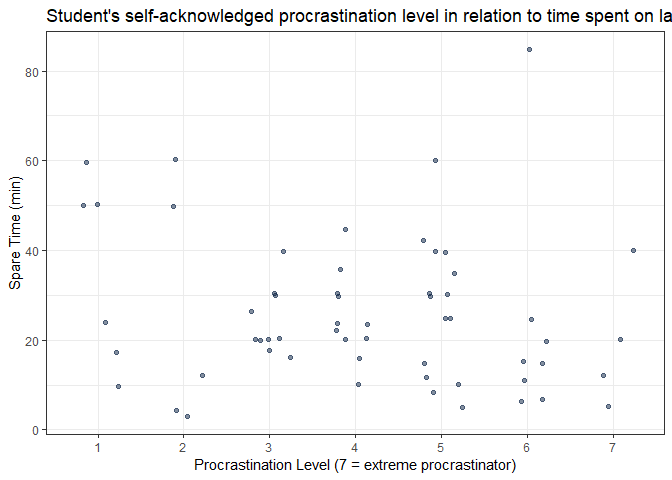
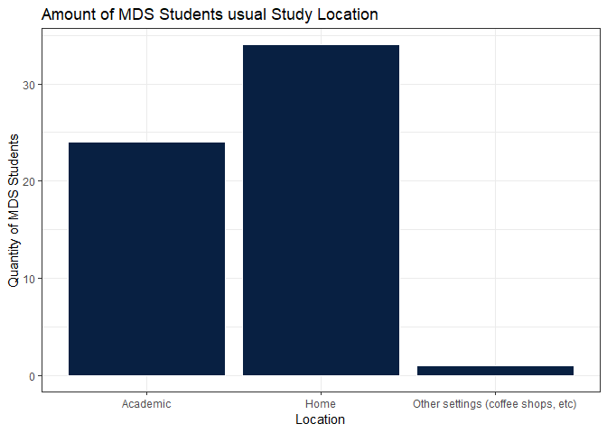

Milestone2
================
Simon Chiu, Sabrina Tse, Sylvia Lee, Hayley Boyce
2019-04-03

## Introduction

Survey link: <https://ubc.ca1.qualtrics.com/jfe/form/SV_agz0I9HiBEeZqBL>

The survey was conducted online anonymously during the lab session on
April 3rd, 2019. We expected that most of the responders were UBC MDS
students in the 2018-2019 cohort since the survey content focused on
gathering MDS students’ study behaviour and location preference.

## The Data

Our survey had 59 participants from the MDS program answer questions
regarding lab completion times specifically for Block 5. In the pursuit
of more accurate results, we tried to reduce the confounding variable of
block difficulty by limiting to a specific recently completed block. To
keep complete anonymity, we did not collect any data that could be
considered as direct or quasi identifying.

### Variable Discription

A discription of the variables are as followed:

  - `Location (fctr)`: Categorical variable, a person’s usual study
    location.  
  - `OptionalQ (dbl)`: Continuous variable, how long a person spends
    doing bonus questions.  
  - `ProcrastLV (int)`: Discrete variable, the level of procrastination
    of which a person identifies. This is an ordinal scale from 1-7, 1
    being not a procrastinator and 7 being the highest form of
    procrastination.
  - `Household_Hr (dbl)`: Continuous variable, the amount of daily
    household responsibilities in hours a person assumes.  
  - `Commute_Hm_Sch_Min (dbl)`: Continuous variable, the amount of time
    it takes to commute from their home to school (one way) in
    minutes.  
  - `Commute_Stu_Loc_Min (dbl)`: Continuous variable, the amount of time
    it takes to move to their usual study location in minutes.  
  - `Time_On_Lab_Hr (dbl)`: Continuous variable, the amount of time
    taken to complete all four labs in hours.  
  - `Spare_Time_Min (dbl)`: Continuous variable, the amount of spare
    time a person has left before the submission
time.

| Location | OptionalQ | ProcrastLV | Household\_Hr | Commute\_Hm\_Sch\_Min | Commute\_Stu\_Loc\_Min | Time\_On\_Lab\_Hr | Spare\_Time\_Min |
| :------- | --------: | ---------: | ------------: | --------------------: | ---------------------: | ----------------: | ---------------: |
| Academic |       0.0 |          7 |           3.0 |                    20 |                     10 |                12 |               10 |
| Home     |       0.0 |          6 |           2.5 |                    35 |                      0 |                11 |              120 |
| Academic |       0.0 |          1 |           2.5 |                    20 |                     10 |                24 |              180 |
| Academic |       4.0 |          6 |           2.5 |                    25 |                     20 |                20 |              180 |
| Home     |       0.5 |          3 |           1.5 |                    40 |                     60 |                20 |             1440 |
| Home     |       0.0 |          5 |           2.0 |                    30 |                     10 |                15 |             2880 |

    ## Warning: `as.tibble()` is deprecated, use `as_tibble()` (but mind the new semantics).
    ## This warning is displayed once per session.

|               Location                |   OptionalQ    |  ProcrastLV   | Household\_Hr  | Commute\_Hm\_Sch\_Min | Commute\_Stu\_Loc\_Min | Time\_On\_Lab\_Hr | Spare\_Time\_Min |
| :-----------------------------------: | :------------: | :-----------: | :------------: | :-------------------- | :--------------------- | :---------------- | :--------------- |
|             Academic :24              |  Min. :0.0000  |  Min. :1.000  |  Min. : 0.500  | Min. : 0.0            | Min. : 0.00            | Min. : 3.00       | Min. : 0.0       |
|               Home :34                | 1st Qu.:0.0000 | 1st Qu.:3.000 | 1st Qu.: 1.500 | 1st Qu.:15.0          | 1st Qu.: 0.00          | 1st Qu.:15.00     | 1st Qu.: 17.5    |
| Other settings (coffee shops, etc): 1 | Median :0.0000 | Median :4.000 | Median : 2.000 | Median :20.0          | Median :10.00          | Median :22.00     | Median : 120.0   |
|                  NA                   |  Mean :0.9474  |  Mean :4.085  |  Mean : 3.246  | Mean :26.2            | Mean :12.27            | Mean :25.85       | Mean : 346.2     |
|                  NA                   | 3rd Qu.:2.0000 | 3rd Qu.:5.000 | 3rd Qu.: 3.000 | 3rd Qu.:35.0          | 3rd Qu.:18.50          | 3rd Qu.:32.50     | 3rd Qu.: 300.0   |
|                  NA                   |  Max. :6.0000  |  Max. :7.000  |  Max. :45.000  | Max. :90.0            | Max. :60.00            | Max. :85.00       | Max. :2880.0     |
|                  NA                   |    NA’s :2     |      NA       |       NA       | NA                    | NA                     | NA                | NA               |

**Language** Due to the statistical nature of the lab and an overall
consensus from the team, we agreed on programming in R.

### Visualization

#### Procrastination

To Start our EDA we wanted to confirm our hypothesis that the
procrastination distribution among students is approximately normal.
<!-- -->

###### Figure 1: Procrastination levels amoung UBC MDS 2018-2019 cohort

You can see that most people consider themselves to be neither extremely
active in lab completetion nor do they leave things to the last moment.
The count per level can be seen below:

| ProcrastLV | count |
| ---------: | ----: |
|          1 |     6 |
|          2 |     5 |
|          3 |    10 |
|          4 |    11 |
|          5 |    15 |
|          6 |     8 |
|          7 |     4 |

#### Study Location

<!-- -->

###### Figure 2: Distribution of usual study locations among UBC MDS 2018-2019 cohort students

From the graph above, we can see that most of us usually study from
home. Furthermore, we identified that `household responsibilties` is a
confounding variable to affect the choice of study location. In the next
section, we will explore on the confounding variable.

#### Household Responsibilties vs Study Location

Proceeding further, we wanted to see if people who spent more time on
household responsibilities tend to study more from home.
<!-- -->

###### Figure 3: Scatterplot of relationship between Daily household responsabilities vs time spent on labs among UBC MDS 2018-2019 cohort students

To give a more clear relationship we took the log scale of both axis,
which did not seem to show anything substantial. This was unexpected as
we anticipated people with more hours of household responsibilties would
tend to study more at home. We also expected those individuals would
have to spend less time on labs to accommodate time required for their
household responsibilties

<!-- -->
