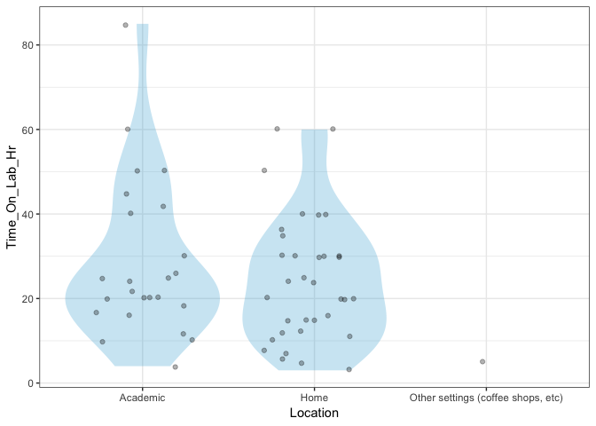
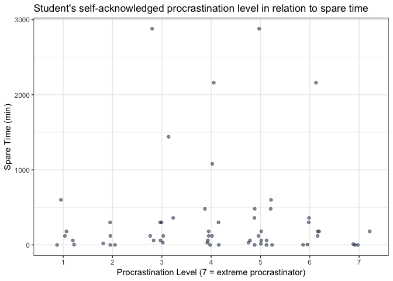
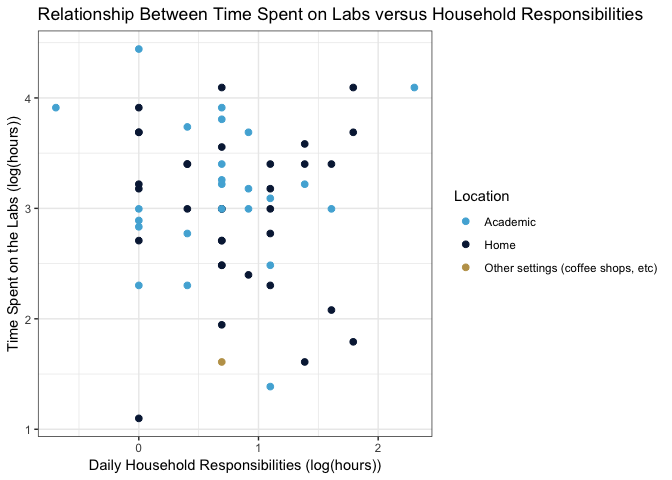
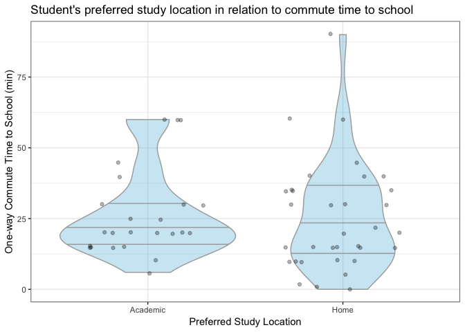

Milestone2
================
Simon Chiu, Sabrina Tse, Sylvia Lee, Hayley Boyce
2019-04-03

Introduction
------------

Survey link: <https://ubc.ca1.qualtrics.com/jfe/form/SV_agz0I9HiBEeZqBL>

The survey was conducted online anonymously during the lab session on April 3rd, 2019. We expected that most of the responders were UBC MDS students in the 2018-2019 cohort since the survey content focused on gathering MDS students' study behaviour and location preference.

The Data
--------

Our survey had 59 participants from the MDS program answer questions regarding lab completion times specifically for Block 5. In the pursuit of more accurate results, we tried to reduce the confounding variable of block difficulty by limiting to a specific recently completed block. To keep complete anonymity, we did not collect any data that could be considered as direct or quasi-identifying.

### Variable Discription

A description of the variables are as followed:

-   `Location (fctr)`: Categorical variable, a person's usual study location.
-   `OptionalQ (dbl)`: Continuous variable, how long a person spends doing bonus questions.
-   `ProcrastLV (int)`: Discrete variable, the level of procrastination of which a person identifies. This is an ordinal scale from 1-7, 1 being not a procrastinator and 7 being the highest form of procrastination.
-   `Household_Hr (dbl)`: Continuous variable, the amount of daily household responsibilities in hours a person assumes.
-   `Commute_Hm_Sch_Min (dbl)`: Continuous variable, the amount of time it takes to commute from their home to school (one way) in minutes.
-   `Commute_Stu_Loc_Min (dbl)`: Continuous variable, the amount of time it takes to move to their usual study location in minutes.
-   `Time_On_Lab_Hr (dbl)`: Continuous variable, the amount of time taken to complete all four labs in hours.
-   `Spare_Time_Min (dbl)`: Continuous variable, the amount of spare time a person has left before the submission time.

| Location |  OptionalQ|  ProcrastLV|  Household\_Hr|  Commute\_Hm\_Sch\_Min|  Commute\_Stu\_Loc\_Min|  Time\_On\_Lab\_Hr|  Spare\_Time\_Min|
|:---------|----------:|-----------:|--------------:|----------------------:|-----------------------:|------------------:|-----------------:|
| Academic |        0.0|           7|            3.0|                     20|                      10|                 12|                10|
| Home     |        0.0|           6|            2.5|                     35|                       0|                 11|               120|
| Academic |        0.0|           1|            2.5|                     20|                      10|                 24|               180|
| Academic |        4.0|           6|            2.5|                     25|                      20|                 20|               180|
| Home     |        0.5|           3|            1.5|                     40|                      60|                 20|              1440|
| Home     |        0.0|           5|            2.0|                     30|                      10|                 15|              2880|

**Summary Statistics**


**Language:**
Due to the statistical nature of the lab and an overall consensus from the team, we agreed on programming in R.

Visualization
-------------

To answer our general question:

**"Does a person's choice of study location (home/academic setting/other public spaces) affect the time they take to finish their MDS assignments (exclusion of optional questions)?"**

The graph illustrates the relationship between the dependent (time spent on labs) and the independent variable (study location) in our study. The visualization shows a greater range of time among students who study at school. The time spent on lab assignments for students who study in the academic location is mostly concentrated around 10 to 30 hours per week, whereas the "Home" group has a wider time range from 9 to 40 hours. The distribution of students who work at home definitely has a smaller standard deviation from the average. For the majority of the analysis, we omit the `other` categorical variable as we feel it is an outlier with a single data point.



###### Figure 1. Distribution of average weekly time spent on assignments in relatioin to a student's usual study site.

#### Univariate distributions

To start our EDA we wanted to confirm our hypothesis that the procrastination distribution among students is approximately normal.


###### Figure 2: Procrastination levels amoung UBC MDS 2018-2019 cohort

You can see that most people consider themselves to be neither extremely active in lab competition nor do they leave things to the last moment. The count per level can be seen below:

|  ProcrastLV|  count|
|-----------:|------:|
|           1|      6|
|           2|      5|
|           3|     10|
|           4|     11|
|           5|     15|
|           6|      8|
|           7|      4|

#### Procrastination as a confounder

``` r
data %>% filter(Location %in% c("Academic", "Home")) %>% 
  ggplot(aes(x = ProcrastLV)) + 
  geom_histogram(bins = 7, colour='white', fill = "#51B1D9")  + 
  theme_bw() + 
  labs(x= "Level of Procrastination", y = "Frequency", title = "Distribution of Procrastination levels among MDS Students") + 
  scale_x_continuous(breaks = seq(1, 7, len = 7) )+
  facet_wrap(~Location)
```


###### Figure 3 Distribution of procrastination levels among UBC MDS 2018-2019 cohort

Interestingly, there is a higher proportion of students that usually study at home who consider themselves as procrastinators. In contrast, the distribution of procrastination levels seems to be more even with students that usually studies at school.

Intuitively, we predicted that procrastination level would be correlated with the amount of spare time students have between assignment completion and the submission deadline.



###### Figure 4: Procrastination levels in relation to spare time before submission deadline

We did not observe the expected negative relationship between spare time and procrastination level. Students across all categories mainly aggregated around 0 minutes to 500 minutes. However, There is a student with a large amount of spare time in the intermediate procrastination levels (level 3,4,5,6). It is hard to determine at this point whether these students should be considered outliers. But interestingly, procrastination level does not seem to affect the time taken to complete assignments (see below):


###### Figure 5: Distribution of Student's self-acknowledged procrastination leve vs time spent on labs

#### Study Location


###### Figure 6: Distribution of usual study locations among UBC MDS 2018-2019 cohort students

From the graph above, we can see that most of us usually study from home. Furthermore, we identified that `household responsibilities` is a confounding variable to affect the choice of study location. Proceeding further, we wanted to see if people who spent more time on household responsibilities tend to study more from home.



###### Figure 7: Scatterplot of the relationship between daily household responsibilities vs time spent on labs among UBC MDS 2018-2019 cohort students

To give a more clear relationship we took the log scale of both axes, which did not seem to show anything substantial. This was unexpected as we anticipated people with more hours of household responsibilities would tend to study more at home. We also expected those individuals would have to spend less time on labs to accommodate the time required for their household responsibilities

Additionally, we expected travel time from school and to study locations to influence a student's choice of site. As there is only one student that prefer to study in sites outside of school and home, this data is omitted from the following visual analyses.



###### Figure 8. Distribution of average daily one-way commute time between home and school for different study locations.

We observed that the distribution of travel time for students that prefer studying at home is more much skewed. This indicates that students with extremely long travel times are less likely to study at school, who may be the outliers. Thus, we can estimate the centrality of these distributions with the median, which seems roughly the same among the two groups. Additionally, the IQR of both distributions is very similar.


###### Figure 9. Distribution of average time taken purposefully to travel to study location in relation to the student's usual study locations.

Interestingly, students that usually study at school, seems to be more likely to take extra time traveling to their study locations. This suggests that a student's tolerant of spending extra time traveling to their usual study spot may be confounding of their choice. It is possible that students that studies at home are less willing to spend time on travel.

Conclusion
----------

Our dataset is very imbalanced as we only retrieved one data point for the `Other Settings` variable. In our analysis, we might consider dropping this data point as it could not be representative of the group. In regards to only the `Academic` and `Home` groups, they are relatively balanced with 24 and 34 students respectively. In the above EDA, we found not all variables explored are confounding on the choice of study location or the time spent on assignments. In particular, The EDA suggests that only the tolerance of time spent on traveling and procrastination may have confounding effects.
