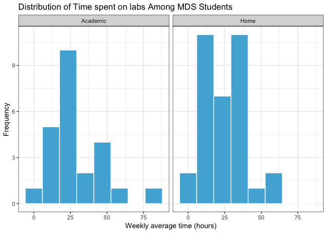
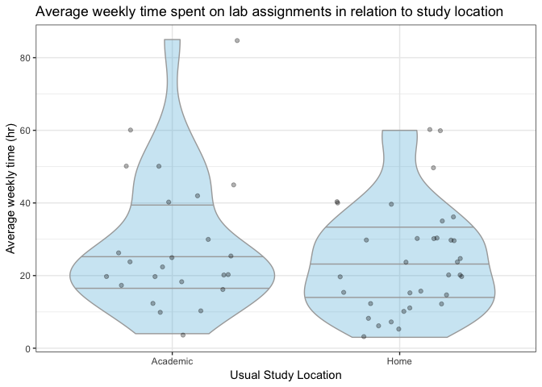

Milestone3
================
Simon Chiu, Sabrina Tse, Sylvia Lee, Hayley Boyce
2019-04-10

Objective - Question
--------------------

Our team created the following analysis to address the following research question:

**"Does a person's choice of study location (home/academic setting/other public spaces) affect the time they take to finish their MDS assignments (exclusion of optional questions)?"**

Labs assignments comprise a big part of the Master of Data Science program. One characteristic of this program is the diversity of students that are enrolled in it. As students in this program, some of us live close to school, others live farther away and we all have different preferences when it comes to where we study. Consequentially, the members of our team have various study habits. As part of this study, we investigated if the choice of study location has an effect on the time a student takes to complete the weekly labs. Do people who choose to work at home perhaps get more distracted? or do they have more time to commit to the labs since they have less commuting time? To address this question we surveyed students in the 2018-2019 MDS cohort to obtain data to conduct our analysis.

In the broader context, the completion and the quality of the lab assignments are crucial to a student's success in the program. This study is the beginning of accessing and exploring how external variables affects a student's enjoyment during the program and the amount of knowledge that they take away from the program. Exploration of these variables is worthwhile in developing strategies to help the students succeed and improve the quality of the MDS program.

Methods
-------

### Survey/ Survey Design

To reiterate what we discussed in Milestone 2, We conducted an anonymous online survey via Quatrics, a survey platform hosted by UBC.

Survey link: <https://ubc.ca1.qualtrics.com/jfe/form/SV_agz0I9HiBEeZqBL>

The survey was conducted online anonymously during the lab session on April 3rd, 2019. We expected that most of the participants to be UBC MDS students in the 2018-2019 cohort as the distribution was via the Slack channel for DSCI 554 course. The survey content focused on gathering MDS students' study behavior and location preference in block 5. We limited the study scope to a specific recently completed block in the attempt to reduce the confounding variable of block difficulty. In the pursuit of more accurate results, we identified and addressed plausible confounding variables including commute time, procrastination tendencies, household responsibilities, and the completion of optional questions as part of the survey.

In compliance to the [UBC Office of Research Ethics document on Using Online Surveys](https://ethics.research.ubc.ca/sites/ore.ubc.ca/files/documents/Online_Survey-GN.pdf), we did not collect any data that could be considered as direct or quasi-identifying to ensure the participants' anonymity. Additionally, the data is not available to the public.

### The Data

We gathered data from 59 participants from the MDS 2018-2019 cohort. The data collected from Qualtrics was exported to a CSV for analysis. We suppressed the IP address columns to guarantee complete anonymity.

The data is being stored in a private repository only accessible by the core study team and authorized personnel. It can be located [here](https://github.ubc.ca/MDS-2018-19/DSCI_554-lab-time-analysis-DATA).

###### Table 1. Description of study parameters

<table>
<colgroup>
<col width="26%" />
<col width="11%" />
<col width="9%" />
<col width="53%" />
</colgroup>
<thead>
<tr class="header">
<th align="center">Parameter</th>
<th align="center">type</th>
<th align="center">variable type</th>
<th align="center">description</th>
</tr>
</thead>
<tbody>
<tr class="odd">
<td align="center"><code>Location</code></td>
<td align="center">fctr</td>
<td align="center">Categorical variable</td>
<td align="center">a person's usual study location</td>
</tr>
<tr class="even">
<td align="center"><code>OptionalQ</code></td>
<td align="center">dbl</td>
<td align="center">Continuous variable</td>
<td align="center">how long a person spends doing bonus questions</td>
</tr>
<tr class="odd">
<td align="center"><code>ProcrastLV</code></td>
<td align="center">int</td>
<td align="center">Discrete variable</td>
<td align="center">the level of procrastination of which a person identifies. This is an ordinal scale from 1-7, 1 being not a procrastinator and 7 being the highest form of procrastination.</td>
</tr>
<tr class="even">
<td align="center"><code>Household_Hr</code></td>
<td align="center">dbl</td>
<td align="center">Continuous variable</td>
<td align="center">the amount of daily household responsibilities in hours a person assumes.</td>
</tr>
<tr class="odd">
<td align="center"><code>Commute_Hm_Sch_Min</code></td>
<td align="center">dbl</td>
<td align="center">Continuous variable</td>
<td align="center">the amount of time it takes to commute from their home to school (one way) in minutes</td>
</tr>
<tr class="even">
<td align="center"><code>Commute_Stu_Loc_Min</code></td>
<td align="center">dbl</td>
<td align="center">Continuous variable</td>
<td align="center">the amount of time it takes to move to their usual study location in minutes.</td>
</tr>
<tr class="odd">
<td align="center"><code>Time_On_Lab_Hr</code></td>
<td align="center">dbl</td>
<td align="center">Continuous variable</td>
<td align="center">the amount of time taken to complete all four labs in hours.</td>
</tr>
<tr class="even">
<td align="center"><code>Spare_Time_Min</code></td>
<td align="center">dbl</td>
<td align="center">Continuous variable</td>
<td align="center">the amount of spare time a person has left before the submission time.</td>
</tr>
</tbody>
</table>

 

###### Table 2. Sample dataset retrieved from survey response

| Location |  OptionalQ|  ProcrastLV|  Household\_Hr|  Commute\_Hm\_Sch\_Min|  Commute\_Stu\_Loc\_Min|  Time\_On\_Lab\_Hr|  Spare\_Time\_Min|
|:---------|----------:|-----------:|--------------:|----------------------:|-----------------------:|------------------:|-----------------:|
| Academic |        0.0|           7|            3.0|                     20|                      10|                 12|                10|
| Home     |        0.0|           6|            2.5|                     35|                       0|                 11|               120|
| Academic |        0.0|           1|            2.5|                     20|                      10|                 24|               180|
| Academic |        4.0|           6|            2.5|                     25|                      20|                 20|               180|
| Home     |        0.5|           3|            1.5|                     40|                      60|                 20|              1440|
| Home     |        0.0|           5|            2.0|                     30|                      10|                 15|              2880|

Results
-------

###### Table 3. Count of students that prefer each study location

| Location |    n|
|:---------|----:|
| Academic |   24|
| Home     |   34|
| Other    |    1|

We found that 24 students usually study in an academic setting, while 34 students prefer to study at home (Table 3.). We had one student that selected "other" study settings, we omitted the "other" location category from the rest of the analysis as it is not representative.

#### EDA Analysis

###### Figure 1: Histogram of weekly average time spent on all labs in Block 5.

Although not exact, the distributions on the amount of time spent on labs are roughly normal for both groups (Figure 1.). If the number of observations increased, we anticipate more normally distributed values. Given the small dataset, it seems to be reasonable to assume normality for both groups given the above histogram.

###### Figure 2: Average weekly time spent on labs in relation to the student's preferred study locations.

There is a larger range of time spent on labs by students who study at school (Figure 2). The data appear much more spares and seem to have higher values which could be an indication that either people are getting distracted at school or people generally put more effort into the assignments. As seen in Figure 2, the sample distribution of the 'academic' group seems to have a greater skew then the sample distribution of students who study at home. Without addressing confounders, the centrality of the two distributions is very similar, which seems to suggest location has minimal effects on lab completion time.

### Confounding Variables

At the beginning of our study, we identified three confounding variables: procrastination, household responsibilities and the commute time to the study location. We first conducted statistical tests to determine the confounding effects of these variables.

#### Comparison - Baseline set-up

For comparison, we set up a baseline model by fitting a simple linear model on the dependent variable (Y) - Time spent on labs per week - and the independent variable (X) - the usual study location. Two groups were included in the model: the group who study in the academic settings("academic group") and the group who study at home (the "home" group).

The reference point in our model (intercept) is the academic group. On average, this group spends 28.7 hours per week on labs; The group who study at home (the 'home' group) comparatively spend 4.4 hours less. However, the difference is not significantly different from 0 (p-value &lt; 0.05) (Model 1.). The statistic coheres with the 95% confidence interval (CIs) of the intercept and slope parameters. In the baseline model, the CI of the slope parameter passes 0, which implying that there is no significant difference in the time spent on labs when comparing the home to the academic group (Table 4.).

###### Model 1. Baseline model with no confounders addressed

    ## 
    ## Call:
    ## lm(formula = Time_On_Lab_Hr ~ Location, data = data_filter)
    ## 
    ## Residuals:
    ##     Min      1Q  Median      3Q     Max 
    ## -24.792 -11.542  -4.382   9.368  56.208 
    ## 
    ## Coefficients:
    ##              Estimate Std. Error t value Pr(>|t|)    
    ## (Intercept)    28.792      3.368   8.550 9.72e-12 ***
    ## LocationHome   -4.409      4.398  -1.002     0.32    
    ## ---
    ## Signif. codes:  0 '***' 0.001 '**' 0.01 '*' 0.05 '.' 0.1 ' ' 1
    ## 
    ## Residual standard error: 16.5 on 56 degrees of freedom
    ## Multiple R-squared:  0.01763,    Adjusted R-squared:  8.708e-05 
    ## F-statistic: 1.005 on 1 and 56 DF,  p-value: 0.3204

###### Table 4. Two-tailed 95% CI of slope and intercept from baseline model (Model 1.)

    ##                  2.5 %   97.5 %
    ## (Intercept)   22.04554 35.53779
    ## LocationHome -13.22039  4.40176

We then added each confounding variable to the baseline model and refitted the model individually to observe the changes in the coefficients and standard errors. Out of the three confounding variables, we noticed the most significant difference in the coefficient and standard error comes from `commute time to the study location` calculated by the percentage changes (Model 2.).

#### The influence of commute time to the study location

###### Model 2. Additive model including commute time to study location as confounder

    ## 
    ## Call:
    ## lm(formula = Time_On_Lab_Hr ~ Location + Commute_Stu_Loc_Min, 
    ##     data = data_filter)
    ## 
    ## Residuals:
    ##     Min      1Q  Median      3Q     Max 
    ## -25.819 -11.050  -4.819   9.239  55.181 
    ## 
    ## Coefficients:
    ##                     Estimate Std. Error t value Pr(>|t|)    
    ## (Intercept)          31.6186     4.2401   7.457 6.73e-10 ***
    ## LocationHome         -5.5583     4.5146  -1.231    0.223    
    ## Commute_Stu_Loc_Min  -0.1800     0.1645  -1.094    0.279    
    ## ---
    ## Signif. codes:  0 '***' 0.001 '**' 0.01 '*' 0.05 '.' 0.1 ' ' 1
    ## 
    ## Residual standard error: 16.47 on 55 degrees of freedom
    ## Multiple R-squared:  0.03855,    Adjusted R-squared:  0.003588 
    ## F-statistic: 1.103 on 2 and 55 DF,  p-value: 0.3392

    ## [1] "Estimate % change in slope coefficient: -26.0591678290924%"

    ## [1] "Estimate % change in Standard Error of coefficient: -2.64127931368116%"

After we introduced the confounding variable - `commute time to the study location per day` into the picture, the model revealed that the 'academic' group spends 31.6 hours and the 'home' group spends 5.6 hours less compared to the academic group (Model 2.). However, the difference between the academic group and home group is not significantly different (p-value &lt; 0.05).

From the observed changes, There is not enough evidence that the confounding variable influences the relationship between time spent on labs per week and the study locations as the addition of the confounder did not change the statistical conclusions. As the standard error of the slope coefficient was not significantly different between Model 1. and Model 2., it suggests that the commute time to study location did not help explain the variation in the data. Furthermore, there is no significant correlation between commute time and lab completion time (p-value &lt; 0.05) (Model 2.).

Discussion
----------

"I study better at school", "I get too distracted when I am at home", or "I can get more help at school" are often phrases that we hear from students. We often associate academic settings as a better learning environment due to the atmosphere and proximity of resources available to students. In this study, we looked at the MDS 2018-2019 cohort to investigate whether the assumption is supported by statistical evidence.

In this observational study, we tried to establish as much causality as possible by collecting information on factors that may influence the dependent variable (lab completion time) and independent variable (study location). Given the time and resources available, we cannot address all the possible confounders. Therefore, we selected a few key confounders that we anticipate to have larger effects on our variables. Our study accounted for major factors that may affect a student's choice of location includes commute time to school, commute to study location and household responsibilities. Similarly, factors that may affect lab completion time included completion of optional questions and extent of procrastination. We treated these influential factors as possible confounders in our analysis. We assessed each confounder through EDA and evaluation of their respective coefficients in the regression model.

Out of all the confounding variables considered, only the commute time stood out as having a plausible effect on the relationship between study locations and the time taken to complete labs. Although statistical tests concluded the parameter `commute time to the study location per day` is not significant, there stands a possibility of error due to the large standard error observed and the small sample size in this study. As the number of observations increase, we anticipate a lower standard error and perhaps more evidence to `commute time to the study location per day` being a confounding variable.

We used lab completion time as a proxy for assessing whether the study environment affects effective learning. Our study question was "Does a person's choice of study location (home/academic setting/other public spaces) affect the time they take to finish their MDS assignments (exclusion of optional questions)?", and we found that the study locations does not significantly affect the students' average lab completion time. The results suggest that easy access to academic settings does not provide significant advantages to students. The observed result may also be due to the characteristic of our sample. All MDS students had experienced at least one degree of higher education. Most students' study style would have been developed by the time of the survey. Thus, it can be inferred that MDS students may already know from experience what kind of environment they work best under. This may explain the similar approximate normal distribution of time spent on labs among the 'academic' group and the 'home' group.

Assumptions
-----------

We are assuming that all participants responded truthfully and accurately. After performing EDA we are able to make the assumption that our variables are normally distributed and that residuals approximately follow a normal distribution. In addition, we assume all our observations are normally distributed.

Limitations
-----------

The research we conducted was extremely limited. Our sample size was very small and therefore the ability to conduct causal inference was affected. We also had a single observation for the category "other" in the location parameter. This limited our analysis to addressing mostly the Academic and home locations. Other limitations include the categorization of the locations which included very few options. We could have extended to libraries, study room, and lounges or if people from home worked in an office or not. A major issue we encountered in that the interpretation of the question by the participants was varied. We believe that some of the outliers misread the questions. We had a limitation on candidates itself and potentially the responses could have been inaccurate or a poor representation of actual values since they were was an estimation according to the individuals.

Future Directions
-----------------

In the future, we might suggest conducting a similar analysis on larger samples, particularly undergraduate students, or specific larger classes. After further reflection, we believe age and collaboration with other students could have had confounding effects. We could improvise our study design by asking additional questions pertaining to these variables. Addition analysis may include assessing if average study times were statistically significant in differing locations. Prediction based analysis instead of causal could also be an area of particular interest.
