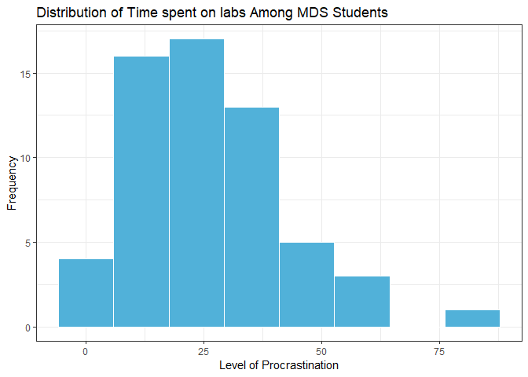

Milestone3
================
Simon Chiu, Sabrina Tse, Sylvia Lee, Hayley Boyce
2019-04-10

## Objective

Our team created the following analysis to address the following
research question:

**“Does a person’s choice of study location (home/academic setting/other
public spaces) affect the time they take to finish their MDS assignments
(exclusion of optional questions)?”**

Labs assignments comprise a big part of the Master of Data Science
program. One characteristic of this program is the diversity of students
that are enrolled in it. As students in this program, some of us live
close to school, other live farther away and we all have different
preferences when it comes to where we study. Consequentially, the
members of our team have various study habits. As part of this study, we
investigated if the choice of study location has an effect on the time a
student takes to complete the weekly labs. Do people who choose to work
at home perhaps get more distracted? or do they have more time to commit
to the labs since they have less commuting time? To address this
question we surveyed students in the 2018-2019 MDS cohort to obtain data
to conduct our analysis.

In the broader context, the completion and the quality of the lab
assignments is crucial to a student’s success in the program. This study
is the beginning of accessing and exploring how external variables
affects a student’s enjoyment during the program and the amount of
knowledge that they take away from the program. Exploration of these
variables is worthwhile in developing strategies to help student succeed
and improve the quality of the MDS program.

## Method

### Survey

To reiterate what we discussed in Milestone 2, We conducted an anonymous
online survey via Quatrics, a survey platform hosted by UBC.

Survey link: <https://ubc.ca1.qualtrics.com/jfe/form/SV_agz0I9HiBEeZqBL>

The survey was conducted online anonymously during the lab session on
April 3rd, 2019. We expected that most of the participants to be UBC MDS
students in the 2018-2019 cohort as the distribution was via the Slack
channel for DSCI 554 course. The survey content focused on gathering MDS
students’ study behaviour and location preference in block 5. We limited
the study scope to a specific recently completed block in the attempt to
reduce the confounding variable of block difficulty. In the pursuit of
more accurate results, we identified and addressed plausible confounding
variables including commute time, procrastination tendencies, household
responsibilities, and the completion of optional questions as part of
the survey.

In compliance to the [UBC Office of Research Ethics document on Using
Online
Surveys](https://ethics.research.ubc.ca/sites/ore.ubc.ca/files/documents/Online_Survey-GN.pdf),
we did not collect any data that could be considered as direct or
quasi-identifying to ensure the participants’ anonymity. Additionally,
the data is not available to the public.

### The Data

We gathered data from 59 participants from the MDS 2018-2019 cohort.

The data is being stored in a private repository only accessible by the
core study team and authorized personels. It can be located
[here](https://github.ubc.ca/MDS-2018-19/DSCI_554-lab-time-analysis-DATA).

**Table 1. Description of study
parameters**

|       Parameter       | type |    variable type     |                                                                                 description                                                                                 |
| :-------------------: | :--: | :------------------: | :-------------------------------------------------------------------------------------------------------------------------------------------------------------------------: |
|      `Location`       | fctr | Categorical variable |                                                                       a person’s usual study location                                                                       |
|      `OptionalQ`      | dbl  | Continuous variable  |                                                               how long a person spends doing bonus questions                                                                |
|     `ProcrastLV`      | int  |  Discrete variable   | the level of procrastination of which a person identifies. This is an ordinal scale from 1-7, 1 being not a procrastinator and 7 being the highest form of procrastination. |
|    `Household_Hr`     | dbl  | Continuous variable  |                                                  the amount of daily household responsibilities in hours a person assumes.                                                  |
| `Commute_Hm_Sch_Min`  | dbl  | Continuous variable  |                                            the amount of time it takes to commute from their home to school (one way) in minutes                                            |
| `Commute_Stu_Loc_Min` | dbl  | Continuous variable  |                                                the amount of time it takes to move to their usual study location in minutes.                                                |
|   `Time_On_Lab_Hr`    | dbl  | Continuous variable  |                                                        the amount of time taken to complete all four labs in hours.                                                         |
|   `Spare_Time_Min`    | dbl  | Continuous variable  |                                                   the amount of spare time a person has left before the submission time.                                                    |

  **Table 2. Sample dataset retrieved from survey
response**

| Location | OptionalQ | ProcrastLV | Household\_Hr | Commute\_Hm\_Sch\_Min | Commute\_Stu\_Loc\_Min | Time\_On\_Lab\_Hr | Spare\_Time\_Min |
| :------- | --------: | ---------: | ------------: | --------------------: | ---------------------: | ----------------: | ---------------: |
| Academic |       0.0 |          7 |           3.0 |                    20 |                     10 |                12 |               10 |
| Home     |       0.0 |          6 |           2.5 |                    35 |                      0 |                11 |              120 |
| Academic |       0.0 |          1 |           2.5 |                    20 |                     10 |                24 |              180 |
| Academic |       4.0 |          6 |           2.5 |                    25 |                     20 |                20 |              180 |
| Home     |       0.5 |          3 |           1.5 |                    40 |                     60 |                20 |             1440 |
| Home     |       0.0 |          5 |           2.0 |                    30 |                     10 |                15 |             2880 |

## Findings

#### Univariate Analysis

An important aspect of our analysis is to address the dependent
variable. We want to assess if it’s acceptable to assume that it
approximately follows a normal
distribution.

<!-- -->

###### Figure 1: Histogram of Dependent variable- time spend on all labs.

Althought it is not exact, we beleive the distribution on amount of time
spent on labs is roughly normal. If the number of observations
increased, we anticipate more normally distributed values.

### Confounding Variables

In our proposal, we identified three confounding variables:
procrastination, household responsibilities and the commute time to the
study location. In this milestone, we will focus on determining the
existence of the causal effects of these confounding variables.

#### Comparison - Baseline set-up

For comparison, we set up a baseline model by fitting a simple linear
model on the dependent variable (Y) - Time spent on labs per week - and
the independent variable (X) - the usual study location. Three groups
included in the model are: the group who study in the academic
settings(“academic group”), the group who study at home (the home
group) and the person who studies neither at home or at school (the
“other” group). In addition, 95% confidence intervals (CIs)were
calculated using the baseline model. From the result below, we can see
that the CI of both the home and other groups pass zero, implying that
there is no significant difference in the time spent on labs when
comparing the home and other groups to the academic group.

    ## 
    ## Call:
    ## lm(formula = Time_On_Lab_Hr ~ Location, data = data)
    ## 
    ## Residuals:
    ##     Min      1Q  Median      3Q     Max 
    ## -24.792 -11.292  -4.382   8.118  56.208 
    ## 
    ## Coefficients:
    ##               Estimate Std. Error t value Pr(>|t|)    
    ## (Intercept)     28.792      3.368   8.550 9.72e-12 ***
    ## LocationHome    -4.409      4.398  -1.002    0.320    
    ## LocationOther  -23.792     16.838  -1.413    0.163    
    ## ---
    ## Signif. codes:  0 '***' 0.001 '**' 0.01 '*' 0.05 '.' 0.1 ' ' 1
    ## 
    ## Residual standard error: 16.5 on 56 degrees of freedom
    ## Multiple R-squared:  0.04485,    Adjusted R-squared:  0.01073 
    ## F-statistic: 1.315 on 2 and 56 DF,  p-value: 0.2767

    ##                   2.5 %    97.5 %
    ## (Intercept)    22.04554 35.537791
    ## LocationHome  -13.22039  4.401760
    ## LocationOther -57.52229  9.938953

We then added each confounding variable to the baseline model and
refitted the model individually to observe the changes in the
coefficients and standard errors. Out of the three confounding
variables, we noticed the most significant difference in the coefficient
and standard error comes from `commute time to the study location`
calculated by the percentage changes.

    ## 
    ## Call:
    ## lm(formula = Time_On_Lab_Hr ~ Location + Commute_Stu_Loc_Min, 
    ##     data = data)
    ## 
    ## Residuals:
    ##     Min      1Q  Median      3Q     Max 
    ## -25.819 -11.040  -4.819   9.139  55.181 
    ## 
    ## Coefficients:
    ##                     Estimate Std. Error t value Pr(>|t|)    
    ## (Intercept)          31.6186     4.2401   7.457 6.73e-10 ***
    ## LocationHome         -5.5583     4.5146  -1.231    0.223    
    ## LocationOther       -21.2197    16.9721  -1.250    0.216    
    ## Commute_Stu_Loc_Min  -0.1800     0.1645  -1.094    0.279    
    ## ---
    ## Signif. codes:  0 '***' 0.001 '**' 0.01 '*' 0.05 '.' 0.1 ' ' 1
    ## 
    ## Residual standard error: 16.47 on 55 degrees of freedom
    ## Multiple R-squared:  0.06519,    Adjusted R-squared:  0.0142 
    ## F-statistic: 1.278 on 3 and 55 DF,  p-value: 0.2909

    ## [1] "LocationHome's Estimate change (%): -26.0591678290926%"

    ## [1] "LocationHome's Std. Err. change (%): -2.64127931368118%"

    ## [1] "LocationOther settings's Estimate change (%): 10.8104056412573%"

    ## [1] "LocationOther settings's Std. Err. change (%): -0.796550454456704%"

To make better and more general inferences, we will only focus on the
home and academic group in the following section as the other group only
represents one individual.

#### The causal influence of commute time to the study location

The reference point in our model (intercept) is the academic group. On
average, this group spends 28.7 hours per week on labs; The group who
study at home (the ‘home’ group) comparatively spend 4.4 hours less.

After we introduced the confounding variable - `commute time to the
study location per day` into the picture, the model revealed that the
academic group spends 31.6 hours and the home group spends 5.6 hours
less compared to the academic group.

From the observed changes, we can infer that the confounding variable
indeed influences the relationship between time spent on labs per week
and the study locations. Our findings indicate that the longer time
spent on travelling to a specific study location, the longer time the
individual has to spend on completing the labs.

## Conclusions

## Assumptions

We are assuming that all participants responded truthfully and
accurately. After performing EDA we are able to make the assumption that
our variables are normally distributed and that residuals approximately
follow a Normal distribution. We assume all our observations are
normally distributed.

## Limitations

The research we conducted was extremely limited. Our sample size was
very small and therefore the ability to conduct causal inference was
affected. We also had a single observation for the category “other” in
the location parameter. This limited our analysis to addressing mostly
the Academic and home locations. Other limitations include the
categorization of the locations which included very few options. We
could have extended to libraries, study room, and lounges or if people
from home worked in an office or not. A major issue we encountered in
that the interpretation of the question by the participants was varied.
We believe that some of the outliers misread the questions. We had a
limitation on candidates itself and potentially the responses could have
been inaccurate or a poor representation of actual values since they
were was an estimation according to the individuals.

## Future Directions

In the future, we might suggest conducting a similar analysis on larger
samples, particularly undergraduate students, or specific larger
classes. After further reflection, we believe age and collaboration with
other students could have had confounding effects. Addition analysis
could be done assessing if average study times were statistically
significant in differing locations. Prediction based analysis instead of
causal could also be an area of particular interest.

## References
