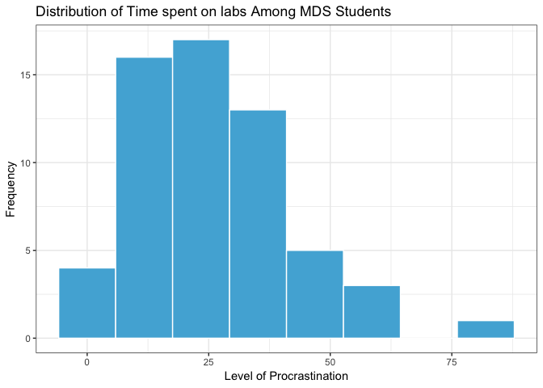

Milestone3
================
Simon Chiu, Sabrina Tse, Sylvia Lee, Hayley Boyce
2019-04-10

Objective
---------

Our team created the following analysis to address the following research question:

**"Does a person's choice of study location (home/academic setting/other public spaces) affect the time they take to finish their MDS assignments (exclusion of optional questions)?"**

The members of our team have various study habits. Some of us live close to school, other live farther away and we all have different preferences when it comes to where we study. We wanted to know if the study location could have an effect on the time an individual takes to complete the weekly labs. Do people who choose to work at home perhaps get more distracted? or do they have more time to commit to the labs since they have no commuting time? To address this question we created a survey to obtain data to conduct our analysis.

Method
------

### Survey

To reiterate what we discussed in Milestone 2, We conducted an anonymous online survey. Survey link: <https://ubc.ca1.qualtrics.com/jfe/form/SV_agz0I9HiBEeZqBL>

The survey was conducted online anonymously during the lab session on April 3rd, 2019. We expected that most of the participants to be UBC MDS students in the 2018-2019 cohort since the survey content focused on gathering MDS students' study behaviour and location preference.

### The Data

Our survey had 59 participants from the MDS program answer questions regarding lab completion times specifically for Block 5. In the pursuit of more accurate results, we tried to reduce the confounding variable of block difficulty by limiting to a specific recently completed block. To keep complete anonymity, we did not collect any data that could be considered as direct or quasi-identifying.

The data is being stored in a private repository only accessible by key personel and those with authorization. It can be located [here](https://github.ubc.ca/MDS-2018-19/DSCI_554-lab-time-analysis-DATA)

For clarity the parameters are defined below:

<table>
<colgroup>
<col width="26%" />
<col width="11%" />
<col width="9%" />
<col width="53%" />
</colgroup>
<thead>
<tr class="header">
<th align="center">Parameter</th>
<th align="center">type</th>
<th align="center">variable type</th>
<th align="center">description</th>
</tr>
</thead>
<tbody>
<tr class="odd">
<td align="center"><code>Location</code></td>
<td align="center">fctr</td>
<td align="center">Categorical variable</td>
<td align="center">a person's usual study location</td>
</tr>
<tr class="even">
<td align="center"><code>OptionalQ</code></td>
<td align="center">dbl</td>
<td align="center">Continuous variable</td>
<td align="center">how long a person spends doing bonus questions</td>
</tr>
<tr class="odd">
<td align="center"><code>ProcrastLV</code></td>
<td align="center">int</td>
<td align="center">Discrete variable</td>
<td align="center">the level of procrastination of which a person identifies. This is an ordinal scale from 1-7, 1 being not a procrastinator and 7 being the highest form of procrastination.</td>
</tr>
<tr class="even">
<td align="center"><code>Household_Hr</code></td>
<td align="center">dbl</td>
<td align="center">Continuous variable</td>
<td align="center">the amount of daily household responsibilities in hours a person assumes.</td>
</tr>
<tr class="odd">
<td align="center"><code>Commute_Hm_Sch_Min</code></td>
<td align="center">dbl</td>
<td align="center">Continuous variable</td>
<td align="center">the amount of time it takes to commute from their home to school (one way) in minutes</td>
</tr>
<tr class="even">
<td align="center"><code>Commute_Stu_Loc_Min</code></td>
<td align="center">dbl</td>
<td align="center">Continuous variable</td>
<td align="center">the amount of time it takes to move to their usual study location in minutes.</td>
</tr>
<tr class="odd">
<td align="center"><code>Time_On_Lab_Hr</code></td>
<td align="center">dbl</td>
<td align="center">Continuous variable</td>
<td align="center">the amount of time taken to complete all four labs in hours.</td>
</tr>
<tr class="even">
<td align="center"><code>Spare_Time_Min</code></td>
<td align="center">dbl</td>
<td align="center">Continuous variable</td>
<td align="center">the amount of spare time a person has left before the submission time.</td>
</tr>
</tbody>
</table>

| Location |  OptionalQ|  ProcrastLV|  Household\_Hr|  Commute\_Hm\_Sch\_Min|  Commute\_Stu\_Loc\_Min|  Time\_On\_Lab\_Hr|  Spare\_Time\_Min|
|:---------|----------:|-----------:|--------------:|----------------------:|-----------------------:|------------------:|-----------------:|
| Academic |        0.0|           7|            3.0|                     20|                      10|                 12|                10|
| Home     |        0.0|           6|            2.5|                     35|                       0|                 11|               120|
| Academic |        0.0|           1|            2.5|                     20|                      10|                 24|               180|
| Academic |        4.0|           6|            2.5|                     25|                      20|                 20|               180|
| Home     |        0.5|           3|            1.5|                     40|                      60|                 20|              1440|
| Home     |        0.0|           5|            2.0|                     30|                      10|                 15|              2880|

Findings
--------

#### Univariate Analysis

An important aspect of our analysis is to address the dependent variable. We want to assess if it's acceptable to assume that it approximately follows a normal distribution.

###### Figure 1: Histogram of Dependent variable- time spend on all labs.

Althought it is not exact, we beleive the distribution on amount of time spent on labs is roughly normal. If the number of observations increased, we anticipate more normally distributed values.

### Confounding Variables

In our proposal, we identified three confounding variables: procrastination, household responsibilities and the commute time to the study location. In this milestone, we will focus on determining the existence of the causal effects of these confounding variables.

#### Comparison - Baseline set-up

For comparison, we set up a baseline model by fitting a simple linear model on the dependent variable (Y) - Time spent on labs per week - and the independent variable (X) - the usual study location. Three groups included in the model are: the group who study in the academic settings("academic group"), the group who study at home (the home group) and the person who studies neither at home or at school (the "other" group). In addition, 95% confidence intervals (CIs)were calculated using the baseline model. From the result below, we can see that the CI of both the home and other groups pass zero, implying that there is no significant difference in the time spent on labs when comparing the home and other groups to the academic group.

    ## 
    ## Call:
    ## lm(formula = Time_On_Lab_Hr ~ Location, data = data)
    ## 
    ## Residuals:
    ##     Min      1Q  Median      3Q     Max 
    ## -24.792 -11.292  -4.382   8.118  56.208 
    ## 
    ## Coefficients:
    ##               Estimate Std. Error t value Pr(>|t|)    
    ## (Intercept)     28.792      3.368   8.550 9.72e-12 ***
    ## LocationHome    -4.409      4.398  -1.002    0.320    
    ## LocationOther  -23.792     16.838  -1.413    0.163    
    ## ---
    ## Signif. codes:  0 '***' 0.001 '**' 0.01 '*' 0.05 '.' 0.1 ' ' 1
    ## 
    ## Residual standard error: 16.5 on 56 degrees of freedom
    ## Multiple R-squared:  0.04485,    Adjusted R-squared:  0.01073 
    ## F-statistic: 1.315 on 2 and 56 DF,  p-value: 0.2767

    ##                   2.5 %    97.5 %
    ## (Intercept)    22.04554 35.537791
    ## LocationHome  -13.22039  4.401760
    ## LocationOther -57.52229  9.938953

We then added each confounding variable to the baseline model and refitted the model individually to observe the changes in the coefficients and standard errors. Out of the three confounding variables, we noticed the most significant difference in the coefficient and standard error comes from `commute time to the study location` calculated by the percentage changes.

    ## 
    ## Call:
    ## lm(formula = Time_On_Lab_Hr ~ Location + Commute_Stu_Loc_Min, 
    ##     data = data)
    ## 
    ## Residuals:
    ##     Min      1Q  Median      3Q     Max 
    ## -25.819 -11.040  -4.819   9.139  55.181 
    ## 
    ## Coefficients:
    ##                     Estimate Std. Error t value Pr(>|t|)    
    ## (Intercept)          31.6186     4.2401   7.457 6.73e-10 ***
    ## LocationHome         -5.5583     4.5146  -1.231    0.223    
    ## LocationOther       -21.2197    16.9721  -1.250    0.216    
    ## Commute_Stu_Loc_Min  -0.1800     0.1645  -1.094    0.279    
    ## ---
    ## Signif. codes:  0 '***' 0.001 '**' 0.01 '*' 0.05 '.' 0.1 ' ' 1
    ## 
    ## Residual standard error: 16.47 on 55 degrees of freedom
    ## Multiple R-squared:  0.06519,    Adjusted R-squared:  0.0142 
    ## F-statistic: 1.278 on 3 and 55 DF,  p-value: 0.2909

    ## [1] "LocationHome's Estimate change (%): -26.0591678290926%"

    ## [1] "LocationHome's Std. Err. change (%): -2.64127931368118%"

    ## [1] "LocationOther settings's Estimate change (%): 10.8104056412573%"

    ## [1] "LocationOther settings's Std. Err. change (%): -0.796550454456704%"

To make better and more general inferences, we will only focus on the home and academic group in the following section as the other group only represents one individual.

#### The causal influence of commute time to the study location

The reference point in our model (intercept) is the academic group. On average, this group spends 28.7 hours per week on labs; The group who study at home (the 'home' group) comparatively spend 4.4 hours less.

After we introduced the confounding variable - `commute time to the study location per day` into the picture, the model revealed that the academic group spends 31.6 hours and the home group spends 5.6 hours less compared to the academic group.

From the observed changes, we can infer that the confounding variable perhaps influences the relationship between time spent on labs per week and the study locations. Although the coefficient is still in the specified confidence interval, the variables standard error is very high. This leads us to believe our findings could have a possible positive relationship between the time spent on travelling to a specific study location and the time the individual has to spend on completing the labs.

Conclusions
-----------

\*\*\*\*\*\*\*\*what did you do well to make this study as causal as possible?\*\*\*\*\*\*\* - sylvia can you address this?

To conclude our analysis, we found that insignificant results to our question "Does a person's choice of study location (home/academic setting/other public spaces) affect the time they take to finish their MDS assignments (exclusion of optional questions)?". With such a small sample size, there was not enough information to conclude a reliable outcome. Of the 3 confounding variables we anticipated, only the commute time stood out as having a possible effect on the relationship between the study location and the time taken to complete labs. Although in practice the parameter `commute time to the study location per day` was viewed as insignificant, we believe this is due to the large standard error and a small number of observations. As the number of observations increase, we anticipate a lower standard error and thus more evidence to `commute time to the study location per day` being a confounding variable.

Assumptions
-----------

We are assuming that all participants responded truthfully and accurately. After performing EDA we are able to make the assumption that our variables are normally distributed and that residuals approximately follow a normal distribution. In addition, we assume all our observations are normally distributed.

Limitations
-----------

The research we conducted was extremely limited. Our sample size was very small and therefore the ability to conduct causal inference was affected. We also had a single observation for the category "other" in the location parameter. This limited our analysis to addressing mostly the Academic and home locations. Other limitations include the categorization of the locations which included very few options. We could have extended to libraries, study room, and lounges or if people from home worked in an office or not. A major issue we encountered in that the interpretation of the question by the participants was varied. We believe that some of the outliers misread the questions. We had a limitation on candidates itself and potentially the responses could have been inaccurate or a poor representation of actual values since they were was an estimation according to the individuals.

Future Directions
-----------------

In the future, we might suggest conducting a similar analysis on larger samples, particularly undergraduate students, or specific larger classes. After further reflection, we believe age and collaboration with other students could have had confounding effects. In the future, we could have improved our study design by asking additional questions pertaining to these variables. Addition analysis could be done assessing if average study times were statistically significant in differing locations. Prediction based analysis instead of causal could also be an area of particular interest.

References
----------
